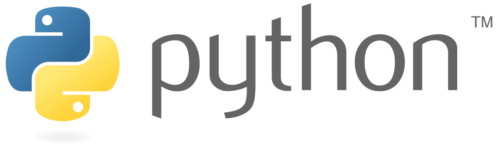

# Prepare your bootcamp

## Learn the fundamentals of programming in Python

You want to join one of BeCode bootcamps, and you feel you need to ramp up your Python programming skills before the beginning of the training?
Great, you're in the right place!


<p align="center">
  
</p>


## Time
How much will it takes?
* If you are **completly new to programming**: **between 1 and 2 weeks**
* If you have some **basic understanding of programming**: **1 week**
* If you are an **experienced programmer** in any other language: **between 2 and 3 days**

In all cases, take the time to explore, play with the code and go deeper than the material presented, because **BeCode is all about curiosity**!

## What will I learn here?
In this track, you will learn:
* How to install Python
* What is Python 
* Programming basics
* Python basics


<p align="center">
  
</p>


## How will I learn?
At BeCode, we apply an **active pedagogy**, meaning that we are not going to **teach** you. Instead, we will **coach** you.
What does it mean in concrete terms? We give you a path to explore and design your journey, but in the end, **YOU** will be the traveller and **you** will decide how fantastic it shall be.

## How does it work?
Let's divide our journey into 2 parts.
1. Install everything on your computer to be able to run Python, to download our courses,...
2. Start to learn Python.

## 1. Install Python
The first step to learn Python is, well, to install it.
To do that, go to [Python's official](https://www.python.org/downloads/) website and download the latest version for your corresponding operating system.

## 2. Jupyter notebook
### What is it?
During this track and the actual course, we are going to use Jupyter notebooks to give you the material.
Jupyter notebooks is a Python tool that will allow you to create or read already existing notebooks.

These notebooks contain:
* Some text. *(our instructions and explanations)*
* Some code. *(your or our examples)*

You will be able to **execute** your code (or our's) directly in it.

### How to install it?
To install it, we will need you to use a tool that is every developer's best friend: the **terminal**. you know, this black and white, or green thing that hackers use in movies? This is it.
The terminal can seems a bit daunting, like black magic to you. No worries, we're going to do it step by step.

1. Launch your terminal :  
    * On **Windows**, go to your start menu's search and type `cmd`.
    * On **Mac**, open your launchpad *(the place where you can see all your applications installed)*, then search for `terminal`.
    * On **Linux**, search for `terminal` in your applications.

2. Now that you have installed Python, `pip` should be installed too. Pip is the package manager of Python. It will help install extensions and libraries, of which jupyter notebook is one. The first step will be to determine if pip is installed. In the terminaln try to type: 
    * `pip3 help`
    * **If you get an error message** saying that it can't find a command named `pip3`, try `pip help`. 
    * Still the same error message? Reinstall Python, something went wrong.

3. Now we can install Jupyter notebooks. If `pip3` works, use this one. If not use `pip`. The command to install Jupyter notebook using `pip` is:
    ```bash
    pip install notebook
    ```
4. To run Jupyter notebooks, you can run:
    ```bash
    jupyter notebook
    ```
5. If it launches a new tab in your internet browser, it worked. If you get an error, something went wrong, you will have to troubleshoot it!

## 3. Let's download the material.
* Click on the green 'Code' button on [this page](https://github.com/becodeorg/BXL-Swartz-4-27) and select 'Download ZIP'.
* Unzip it wherever you want.

## 4. Run the notebooks
Launch Jupyter notebooks again. In the browser you should see folders that correspond to the folders sitting on your computer's hard drive.

You will need to find the files you just unzipped. It depends in which folder you ran the `jupyter notebook` command and where you unzipped the files you downloaded.

When you have them, click on `course` folder, then `1.basic-python-syntax` and finally `basic-python-syntax.ipynb`. That's the first course that you'll learn.

## 5. Let the journey begin!
Read the instructions, you're ready to go!


